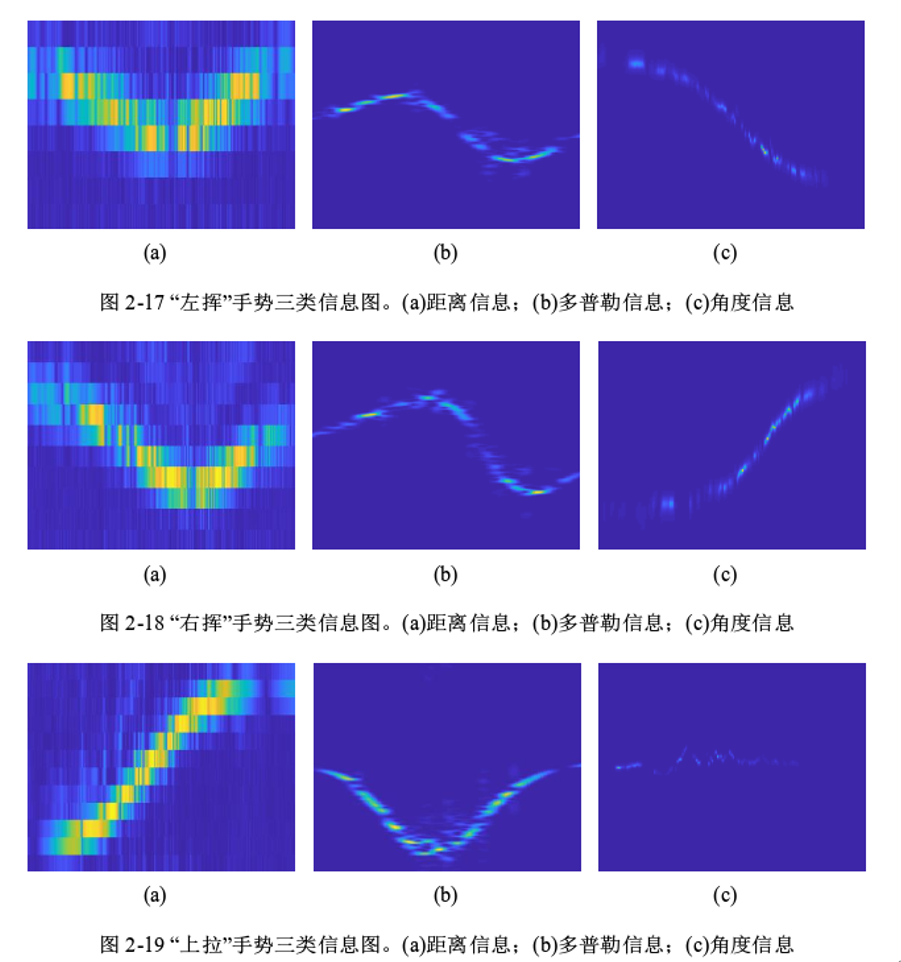

# 手势信息提取

参考文献：李楚杨. 基于毫米波雷达的手势识别算法研究[D].电子科技大学,2020.DOI:10.27005/d.cnki.gdzku.2020.003496.

本部分主要实现参考文献的第二章——手势信号的获取及预处理。

前期暂未购入数据采集卡 DCA1000EVM，仅使用雷达采集数据，PDF(./串口读取数据/docs/准备研究串口采集数据的情况.pdf)介绍了雷达串口数据的采集。

后期将数据采集卡连接到雷达上，并与 PC 机的网口相连，操作 mmWave Studio 采集原始数据，并在 matlab 中进行处理，提取相应的手势信息。

## 雷达数据帧读取

本部分对应 "./串口读取数据/帧读取距离速度角度"。

1. image: 需烧录入雷达的二进制文件。
2. data_sample: 采集的数据样例
3. data_proc code: 帧解析代码
4. radar cfg: 雷达配置文件

[PDF](串口读取数据/docs/串口数据解析.pdf)介绍了雷达数据串口的帧结构，通过解析帧中的数据可以获取雷达探测到的物体的位置和速度。

[PDF](串口读取数据/帧读取距离速度角度/docs/最近工作.pdf)对本部分工作做出总结。

## 雷达原始数据读取

本部分对应 "./串口读取数据/帧读取原始数据"。

1. image: 需烧录入雷达的二进制文件。
3. data_proc code: 数据处理代码
4. radar cfg: 雷达配置文件

[PDF](串口读取数据/帧读取原始数据/docs/串口采集原始数据.pdf)详细介绍了雷达原始数据读取的流程。

## 使用 DCA1000 + mmWave Studio 软件进行数据采集

本部分对应 "./DCA1000+mmWave Studio 进行数据采集"。

不提供数据处理代码。

[PDF](DCA1000+mmWave_Studio进行数据采集/使用DCA1000+mmWave_Studio软件进行数据采集.pdf)完整地介绍了手势信息的采集和预处理流程。

## 预期效果

